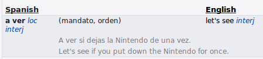

# aver
active vision models, built with the [Nengo neural simulator](https://www.nengo.ai/).

## installation

```console
$ pip install aver
```

## about
### background
The phrase "active vision" is meant to refer to any model of vision that incorporates 
eye movements. For background, please see:
* Findlay, John M., and Iain D. Gilchrist. *Active vision: The psychology of looking and seeing.* 
No. 37. Oxford University Press, 2003. 
<https://www.worldcat.org/title/active-vision-the-psychology-of-looking-and-seeing/>
* Hulleman, J., & Olivers, C. (2017). The impending demise of the item in visual search. 
Behavioral and Brain Sciences, 40, E132. doi:10.1017/S0140525X15002794
<https://www.cambridge.org/core/journals/behavioral-and-brain-sciences/article/impending-demise-of-the-item-in-visual-search/263B1FA1A593ED41B5CF644784D94A46>
* Yang, Scott Cheng-Hsin, Daniel M. Wolpert, and Mate Lengyel. "Theoretical perspectives on active sensing." 
Current Opinion in Behavioral Sciences 11 (2016): 100-108.
<https://www.ncbi.nlm.nih.gov/pmc/articles/PMC6116896/>

For a brief introduction to active vision models, and how they relate to the typical tasks 
used to investigate visual search in the laboratory, please see 
[this notebook](./doc/notebooks/fvf-model-results.ipynb). The notebook contains results 
from a replication of an active vision-type model described in the Hulleman and Olivers 
commentary cited above.

### license
[BSD](./LICENSE)

### name
  
(from <http://www.wordreference.com/>)  
<https://youtu.be/ENrgKe9vIyQ>  
<http://www.pirouzu.net/lyrics-main/runners-high/tashikame-ni-yukou-t/>  
